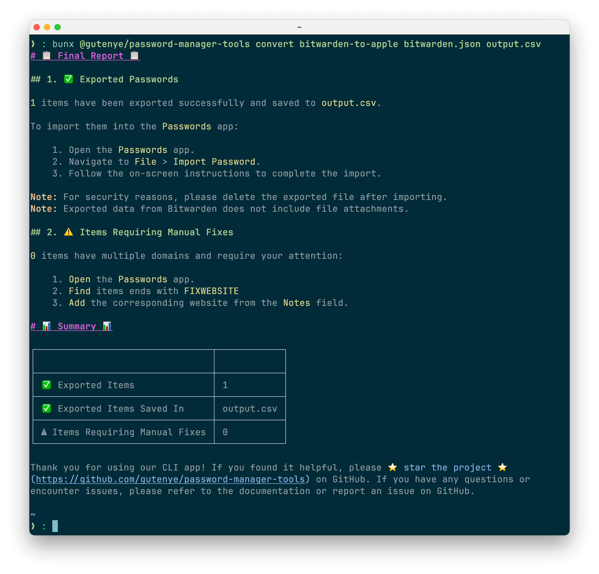
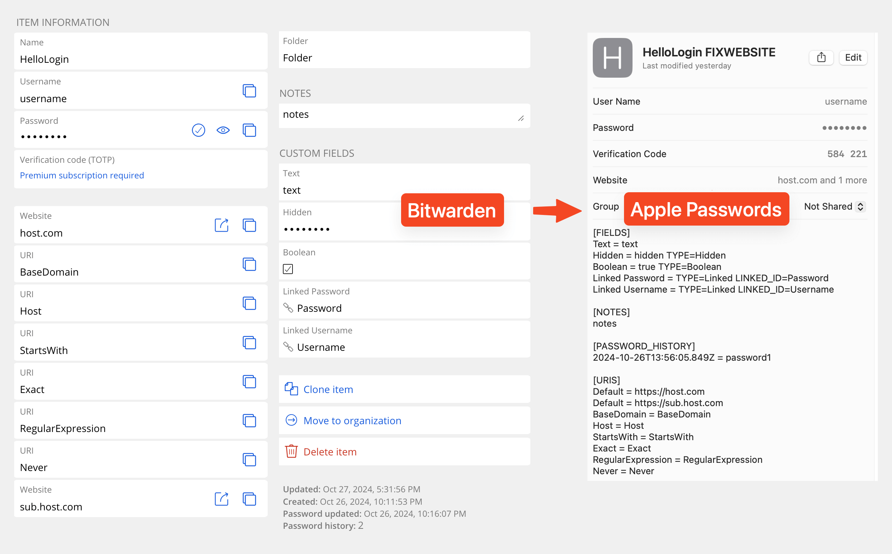

# 🔒 PasswordManagerTools 🔒


[](https://github.com/gutenye/password-manager-tools) [](https://www.npmjs.com/package/@gutenye/password-manager-tools) [](https://github.com/gutenye/password-manager-tools/blob/main/LICENSE)

> 🚀 Easily transfer passwords from Bitwarden to Apple Passwords



## 📷 Screenshots

<details>
<summary>Click to view screenshots</summary>



</details>

## 🌟 Features

- 📦 **Comprehensive Data Preservation**: Transfer everything including notes, custom fields, multiple URLs, and password history seamlessly.
- 🔗 **Multi-URL Handling:** Correctly handle items that contain multiple URLs.
- 📊 **In-Depth End Report:** Receive a detailed report and summary at the end.
- 🎯 **Selective Transfer:** Filter passwords by URL or count to transfer only the items you need.
- ⏱️ **Incremental Transfer:** Move passwords in batches at your convenience, with remaining passwords securely stored for future transfers until all are moved.
- 🔄 **Reverse Transfer (TODO):** Seamlessly transfer passwords from Apple Passwords back to Bitwarden, accurately setting custom fields, multiple URLs, and maintaining password history to ensure data integrity.

## 🚀 Getting Started

⚠ **Note:** Currently, only supports transferring data from Bitwarden to Apple Passwords.

### 1️⃣ Export Data

- Bitwarden: Follow [this official guide](https://bitwarden.com/help/export-your-data) to export your data in `.json (Encrypted)` format with `Password protected`.

### 2️⃣ Convert Data

1. Install Bun: Follow [this official guide](https://bun.sh/docs/installation) to set it up on your machine.

2. Convert passwords

Use the following command to convert your export to another format for import.

```sh
bunx @gutenye/password-manager-tools convert bitwarden-to-apple <input.json> <output.csv>
```

- Replace `<input.json>` with the path to your exported file.
- Replace `<output.csv>` with the desired path for the output file.

### 3️⃣ Import Data

- Apple Passwords: Follow [this official guide](https://support.apple.com/guide/passwords/import-mchl2f1a184c/1.0/mac) to import your `.csv` file into Apple Passwords.

## 🙏 Special thanks

- [Flaksp's script](https://gist.github.com/flaksp/6fe1042e12b6b6908c5193c0d6c124a7): Python script to convert Bitwarden to Apple Passwords
- [warden](https://github.com/thewh1teagle/warden): Offline bitwarden viewer

## 🤝 Contributing

We welcome contributions from the community! Whether it’s reporting bugs, suggesting features, or submitting pull requests, your help is appreciated.

1. Fork the Repository
2. Create a Feature Branch: `git checkout -b feature/YourFeature`
3. Commit Your Changes: `git commit -m "Add some feature"`
4. Push to the Branch: `git push origin feature/YourFeature`
5. Open a Pull Request on Github

Please ensure your code follows our Code of Conduct and passes all tests.

---

Thank you for using PasswordManagerTools! 🔐 ✨ If you found it helpful, please ⭐️ star the project ️️⭐ on GitHub. If you have any questions or encounter issues, please refer to the documentation or report an issue on GitHub.